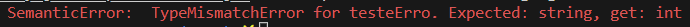
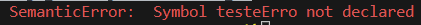
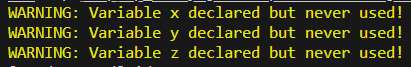

# IsiLanguageEmbriao - Projeto de Compiladores

## Integrantes

| RA | NOME |
|---|---|
| 11071916 | Gabriel Murakami Alves |
| 21032616 | Fabrício Expedito Albano Gaeta |
| 21054116 | Fernando Augusto Machado |
| 21075316 | Vinicius Pedroso Felix Aquino |
| 21029416 | Beatriz de Freitas Braga |

## Vídeo

<https://youtu.be/i-nYFqK1VTw>

## Checklist

### Itens Obrigatórios
| Check | Item |
|---|---|
|[x]| Possui 2 tipos de variáveis |
|[x]| Possui a estrutura If.. else |
|[x]| Possui estrutura de controle while/do while |
|[x]| Operações Aritméticas executadas corretamente |
|[x]| Atribuições realizadas corretamente |
|[x]| Possui operações de Entrada e Saída |
|[x]| Aceita números decimais |
|[x]| Verificar se a variável já foi previamente declarada |
|[x]| Verificar se a variável foi declarada e não foi usada |
|[x]| Verificar se uma variável está sendo usada sem ter valor inicial |

### Itens Opcionais (aqui estão apenas alguns exemplos)
| Check |ITEM|Complexidade|
|---|---|---|
|[ ]| (1) Editor Highlight (simulando uma pequena IDE) | 3
|[ ]| (2) Avaliador de expressões aritméticas | 3
|[ ]| (3) Inserção de Operadores lógicos | 2
|[ ]| (4) Geração de várias linguagens-alvo | 3
|[ ]| (5) Uma API Rest para implementação do compilador | 4
|[ ]| (6) Um Interpretador (runtime) para a linguagem | 5

## Exemplo de Entrada

```Java
programa
  int a, b, x, y, z;
  double numero;
  string teste;

  leia(a);
  leia(b);
  teste = "AWESOME STRING";

  escolha(teste) {
    quando "NOT AWESOME STRING":
      escreva("BAD");
      pare;
    quando "AWESOME STRING":
      escreva("AWESOME");
      pare;
    padrao:
      escreva("NDA");
      pare;
  }
fimprog.
```

## Exemplo de Lista de Comandos na Saída
```Shell
WARNING: Variable a declared but never used!
WARNING: Variable b declared but never used!
WARNING: Variable numero declared but never used!
WARNING: Variable x declared but never used!
WARNING: Variable y declared but never used!
WARNING: Variable z declared but never used!
[ReadCommand] id=a
[ReadCommand] id=b
[AssignmentCommand] id=teste, expr="AWESOME STRING"
[CaseCommand] caseCommands={"AWESOME STRING"=[[WriteCommand] id="AWESOME"], "NOT AWESOME STRING"=[[WriteCommand] id="BAD"]}, condition=teste, defaultsCommands=[[WriteCommand] id="NDA"]
```

## Exemplos de Erros/Warnigs

#### Incompatibilidade de tipos



#### Variável Não Declarada



#### Variável Não Utilizada


